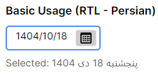
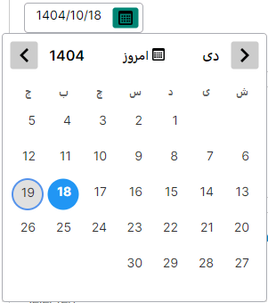

<div align="center">


# ModernPersianDatePicker

</div>

A modern, fully-featured Persian (Jalali/Shamsi) DatePicker control for **Avalonia UI**, inspired by the popular [FarsiLibrary](https://github.com/HEskandari/FarsiLibrary) for WPF/WinForms.


## Features

- ✅ **Full Persian Calendar Support** - Accurate Jalali/Shamsi date calculations with leap year support
- ✅ **RTL & LTR Layouts** - Right-to-left for Persian, Left-to-right for English
- ✅ **Multi-Language Support** - Farsi, English, Arabic, Kurdish + custom via `ICalendarLocalization`
- ✅ **Calendar Type** - Persian, Gregorian, or Auto-detect from thread culture
- ✅ **Keyboard Navigation** - Full keyboard support for accessibility
- ✅ **Editable Mode** - Type dates manually with validation
- ✅ **Month/Year Selection** - Quick dropdown selectors for month and year
- ✅ **Today Button** - Quick access to current date
- ✅ **Time Picker** - Optional Hour/Minute/Second spinners
- ✅ **Date Range Picker** - Select start and end dates
- ✅ **Weekly Holidays** - Configurable `DayOfWeek` recurring holidays
- ✅ **Specific Date Holidays** - Mark individual dates as holidays with custom brush
- ✅ **Custom Accent Brush** - Override the theme accent for selected day, today border, etc.
- ✅ **Light/Dark Theme** - Per-instance theme mode (System/Light/Dark) or app-wide
- ✅ **Min/Max Date Validation** - Restrict date range
- ✅ **Multiple Date Formats** - Long, short, and month display formats
- ✅ **Modern UI** - Beautiful styling with hover effects and visual feedback
- ✅ **MVVM Ready** - Full data binding support with compiled bindings

## Installation

### Option 1: Clone the Repository
```bash
git clone https://github.com/raminmjj/ModernPersianDatePicker.git
cd ModernPersianDatePicker
```

### Option 2: Add as Project Reference
1. Clone or download the repository
2. Add reference to your Avalonia project:
```xml
<ProjectReference Include="..\ModernPersianDatePicker\ModernPersianDatePicker.csproj" />
```

### Option 3: NuGet Package (Coming Soon)
```bash
dotnet add package ModernPersianDatePicker
```

## Quick Start

### 1. Add Styles to App.axaml
```xml
<Application xmlns="https://github.com/avaloniaui"
             xmlns:x="http://schemas.microsoft.com/winfx/2006/xaml"
             x:Class="YourApp.App"
             xmlns:persian="using:ModernPersianDatePicker">
    <Application.Styles>
        <FluentTheme />
        <StyleInclude Source="avares://ModernPersianDatePicker/Themes/ModernPersianDatePickerTheme.xaml"/>
    </Application.Styles>
</Application>
```

### 2. Use in Your XAML
```xml
<Window xmlns="https://github.com/avaloniaui"
        xmlns:x="http://schemas.microsoft.com/winfx/2006/xaml"
        xmlns:persian="using:ModernPersianDatePicker"
        x:Class="YourApp.MainWindow">
    
    <StackPanel Margin="20">
        <!-- Basic Usage (Persian, RTL) -->
        <persian:ModernPersianDatePicker 
            Width="250"
            Margin="0,10"/>
        
        <!-- English Language (LTR) -->
        <persian:ModernPersianDatePicker 
            Language="English"
            FlowDirection="LeftToRight"
            Width="250"
            Margin="0,10"/>
        
        <!-- Editable Mode -->
        <persian:ModernPersianDatePicker 
            IsEditable="True"
            InvalidValueAction="SetToToday"
            Width="250"
            Margin="0,10"/>
        
        <!-- With Date Range -->
        <persian:ModernPersianDatePicker 
            MinDate="1400/01/01"
            MaxDate="1410/12/29"
            Width="250"
            Margin="0,10"/>

        <!-- Time Picker -->
        <persian:ModernPersianDatePicker 
            IsTimePickerEnabled="True"
            Width="250"
            Margin="0,10"/>

        <!-- Date Range Picker -->
        <persian:ModernPersianDatePicker 
            IsRangeMode="True"
            Width="250"
            Margin="0,10"/>

        <!-- Custom Accent & Gregorian Calendar -->
        <persian:ModernPersianDatePicker 
            CalendarType="Gregorian"
            Language="English"
            AccentBrush="#FF4CAF50"
            Width="250"
            Margin="0,10"/>
    </StackPanel>
</Window>
```

## Properties

| Property | Type | Default | Description |
|----------|------|---------|-------------|
| `SelectedDate` | `PersianDate?` | `null` | The selected Persian date |
| `DisplayFormat` | `string` | `"long"` | Date display format (`"long"`, `"short"`, `"month"`) |
| `Language` | `CalendarLanguage` | `Farsi` | Calendar language (Farsi, English, Arabic, Kurdish) |
| `CalendarType` | `CalendarType` | `Auto` | Calendar system (Auto, Persian, Gregorian) |
| `IsEditable` | `bool` | `false` | Allow manual date typing |
| `InvalidValueAction` | `InvalidValueAction` | `SetToNull` | Action for invalid input |
| `MinDate` | `PersianDate?` | `null` | Minimum selectable date |
| `MaxDate` | `PersianDate?` | `null` | Maximum selectable date |
| `Watermark` | `string` | `"Select date..."` | Placeholder text |
| `Theme` | `ThemeMode` | `System` | Per-instance theme (System, Light, Dark) |
| `AccentBrush` | `IBrush?` | `null` | Override accent color for selection and focus |
| `HolidayBrush` | `IBrush?` | `null` | Override color for holiday day numbers |
| `WeeklyHolidays` | `IReadOnlyList<DayOfWeek>` | `[Friday]` | Days of week treated as holidays |
| `Holidays` | `IReadOnlyList<PersianDate>` | `[]` | Specific dates to mark as holidays |
| `IsTimePickerEnabled` | `bool` | `false` | Show time picker spinners below calendar |
| `Hour` | `int` | `0` | Selected hour (0-23) |
| `Minute` | `int` | `0` | Selected minute (0-59) |
| `Second` | `int` | `0` | Selected second (0-59) |
| `IsRangeMode` | `bool` | `false` | Enable date range selection |
| `RangeStart` | `PersianDate?` | `null` | Start of selected range |
| `RangeEnd` | `PersianDate?` | `null` | End of selected range |
| `LocalizationProvider` | `ICalendarLocalization?` | `null` | Custom localization provider |

## Events

### `SelectedDateChanged`
Fired when the selected date changes.

```csharp
datePicker.SelectedDateChanged += (sender, e) =>
{
    if (e.NewDate.HasValue)
    {
        Console.WriteLine($"Selected: {e.NewDate.Value.ToString("long")}");
    }
};
```

### `DateRangeSelected`
Fired when a date range is fully selected (in `IsRangeMode`).

```csharp
datePicker.DateRangeSelected += (sender, e) =>
{
    Console.WriteLine($"Range: {e.RangeStart} ~ {e.RangeEnd}");
};
```

## Keyboard Navigation

When the calendar is open, use these keys:

| Key | Action |
|-----|--------|
| `←` (Left) | Next day / Next month (at month end) |
| `→` (Right) | Previous day / Previous month (at month start) |
| `↑` (Up) | Previous week / Previous month (same weekday) |
| `↓` (Down) | Next week / Next month (same weekday) |
| `PageUp` | Previous month |
| `PageDown` | Next month |
| `Home` | First day of month |
| `End` | Last day of month |
| `Space` / `Enter` | Select focused day |
| `Escape` | Close calendar |

## Editable Mode

When `IsEditable="True"`, users can type dates manually:

### Supported Formats
```
1404/10/18    ✓ Slash separator
1404-10-19    ✓ Dash separator
1404_10_20    ✓ Underscore separator
04/10/21      ✓ 2-digit year (→ 1404)
```

### Invalid Value Actions

```csharp
// Set to null if invalid
InvalidValueAction="SetToNull"

// Set to today if invalid
InvalidValueAction="SetToToday"

// Keep current value if invalid
InvalidValueAction="Keep"
```

## Localization

Built-in languages: **Farsi**, **English**, **Arabic**, **Kurdish**.

To add a custom language, implement `ICalendarLocalization`:

```csharp
public class MyLocalization : ICalendarLocalization
{
    public string[] MonthNames => new[] { "Month1", "Month2", /* ... */ };
    public string[] DayNames => new[] { "Day1", "Day2", /* ... */ };
    public string[] ShortMonthNames => new[] { "M1", "M2", /* ... */ };
    public string[] ShortDayNames => new[] { "D1", "D2", /* ... */ };
}

// Use it:
datePicker.LocalizationProvider = new MyLocalization();
```

## Theming

### App-Wide Theme
```xml
<Application RequestedThemeVariant="Dark">
```

### Per-Instance Theme
```xml
<persian:ModernPersianDatePicker Theme="Dark" />
```

### Custom Accent
```xml
<persian:ModernPersianDatePicker AccentBrush="#FF4CAF50" />
```

## Holidays

### Weekly Holidays
```csharp
// Friday + Saturday (Persian weekend)
datePicker.WeeklyHolidays = new[] { DayOfWeek.Friday, DayOfWeek.Saturday };
```

### Specific Date Holidays
```csharp
datePicker.Holidays = new[]
{
    new PersianDate(1405, 1, 1, 1),   // Nowruz
    new PersianDate(1404, 10, 18, 6), // Yalda Night
};
```

### Custom Holiday Brush
```xml
<persian:ModernPersianDatePicker HolidayBrush="#FFFF8800" />
```

## Gregorian Calendar Mode

```xml
<persian:ModernPersianDatePicker 
    CalendarType="Gregorian"
    Language="English"
    FlowDirection="LeftToRight" />
```

## Helper Classes

### `PersianCalendarHelper`
Utility class for Persian date operations:

```csharp
// Convert Gregorian to Persian
var persianDate = PersianCalendarHelper.ToPersianDate(DateTime.Today);

// Convert Persian to Gregorian
var gregorianDate = persianDate.ToDateTime();

// Get today's Persian date
var today = PersianCalendarHelper.Today();

// Check leap year
bool isLeap = PersianCalendarHelper.IsLeapYear(1404);

// Get days in month
int days = PersianCalendarHelper.GetDaysInMonth(1404, 12);

// Get month/day names
string monthName = PersianCalendarHelper.GetMonthName(1, useEnglish: false); // "فروردین"
string dayName = PersianCalendarHelper.GetDayName(0, useEnglish: false);    // "شنبه"
```

### `PersianDate`
Structure representing a Persian date:

```csharp
var date = new PersianDate(year: 1403, month: 10, day: 19, dayOfWeek: 7);

// ToString formats
date.ToString();        // "1404/10/19"
date.ToString("long");  // "جمعه ۱۹ دی ۱۴۰۴"
date.ToString("short"); // "1404/10/19"
date.ToString("month"); // "دی ۱۴۰۴"

// Comparison
if (date1 > date2) { ... }
if (date1.CompareTo(date2) > 0) { ... }

// Convert to Gregorian
DateTime gregorian = date.ToDateTime();
```

## Demo Application

The solution includes a demo application showcasing all features, with three window variants:

- **MainWindow** - Code-behind style
- **MvvmWindow** - Manual MVVM (INotifyPropertyChanged + ICommand)
- **MvvmToolkitWindow** - CommunityToolkit.Mvvm ([ObservableProperty] + [RelayCommand])

```bash
cd demo/ModernPersianDatePicker.Demo
dotnet run
```

## Screenshots

### Persian (RTL) Mode



### Calendar View



## Requirements

- **.NET 8.0** or later
- **Avalonia UI 11.3.11** or later
- Windows, Linux, macOS support

## Building from Source

```bash
# Restore dependencies
dotnet restore

# Build library
dotnet build src/ModernPersianDatePicker

# Build demo
dotnet build demo/ModernPersianDatePicker.Demo

# Run demo
dotnet run --project demo/ModernPersianDatePicker.Demo

# Run tests
dotnet test
```

## Roadmap

- [x] Time picker component
- [x] Date range picker
- [x] Custom themes
- [x] More localization options (Arabic, Kurdish + custom provider)
- [x] Gregorian calendar mode
- [x] Weekly & specific date holidays
- [x] Custom accent brush
- [x] Per-instance theme mode
- [x] MVVM demo windows

## Contributing

Contributions are welcome! Please feel free to submit a Pull Request.

1. Fork the repository
2. Create your feature branch (`git checkout -b feature/AmazingFeature`)
3. Commit your changes (`git commit -m 'Add some AmazingFeature'`)
4. Push to the branch (`git push origin feature/AmazingFeature`)
5. Open a Pull Request

## License

This project is licensed under the MIT License - see the [LICENSE](LICENSE) file for details.

## Acknowledgments

- Inspired by [HEskandari/FarsiLibrary](https://github.com/HEskandari/FarsiLibrary) for WPF/WinForms
- Built with [Avalonia UI](https://avaloniaui.net/)
- Vibe Coding with [Qwen Code CLI](https://qwenlm.github.io)
- Persian calendar algorithms based on standard Jalali calendar calculations

## Support

If you find this library helpful, please give it a ⭐️ star on GitHub!

**Issues & Questions:** [GitHub Issues](https://github.com/raminmjj/ModernPersianDatePicker/issues)

---

**Made with ❤️ for the Persian .NET Community**
